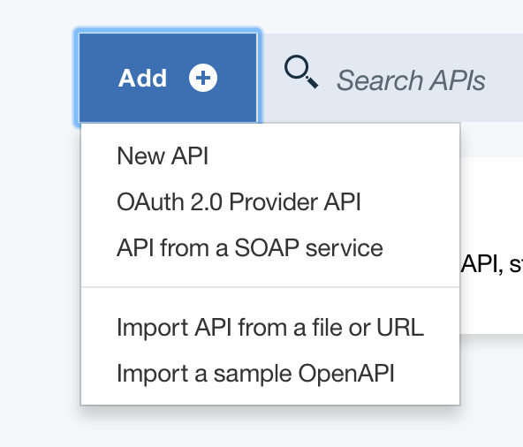

---
 
copyright:
years: 2017
lastupdated: "2017-06-22"
 
---
# Managing a SOAP service
**Duration**: 15 mins  
**Skill level**: Beginner  

[Prerequisites](https://github.com/ibm-apiconnect/getting-started/blob/master/bluemix/0-prereq/README.md)

Before you begin, copy the WSDL file located at https://github.com/ibm-apiconnect/getting-started/blob/master/bluemix/manage-soap-api/files/weatherprovider.wsdl to your local filesystem.

---
### Objective
In API Manager, you will create a SOAP API that is a proxy for a SOAP-based weather service.  

---
### Setting up a SOAP API definition
1. Log in to IBM Bluemix: https://new-console.ng.bluemix.net/login.

2. In the Bluemix **Dashboard**, launch the API Connect service.


3. In API Manager, if you have not previously pinned the UI navigation pane then click the **Navigate to** icon .  The API Manager UI navigation pane opens. To pin the UI Navigation pane, click the **Pin menu** icon .

4. Click **Drafts** > **APIs**.

5. In the APIs panel, click **Add** > **API from SOAP service**.



6. The New API from WSDL dialog box opens.  Click **Upload File**.


7. Select the ```weatherprovider.wsdl``` file.

8. The New API from WSDL dialog box reappears.  Check the **weatherService** check box. Click **Done**.


9.Your API is now created. The Design page displays.


10.	Scroll down to the Security tab, and delete the "clientIDHeader (API Key)" that has been been auto-generated.

11.	Click the disk icon in the upper right corner to save your changes.

12.	Click **Assemble**.


---
### Testing the SOAP API definition
1. In the **Assemble** tab, click the ellipses (three dots) in the upper right corner, and select **Generate a default product** from the menu.  
    

2. Accept the default options in the **New Product** dialog pop-up, and select **Create Product**. The **weatherService product 1.0.0** is created and published to the Sandbox catalog.    
    
  
  - _In API Connect, **Products** provide a mechanism to  group APIs that intended for a particular use. Products are published to a **Catalog**.  [Reference: API Connect glossary]_

3. Save and click ► to test the API service.

4. **If the ``weatherService product`` is not shown in the current setup,** or if you see the **Add API** prompt, click **Change setup**.  Otherwise, skip to step 7.


5. Choose ```weatherService product 1.0.0``` from the list of products.


6.	Click **Next**.

7.	Select ```post /weatherRequest``` from the list of operations.


8.	Scroll down. Enter the following xml in the body field.
```
<?xml version="1.0" encoding="UTF-8"?>
<soap:Envelope xmlns:xsi="http://www.w3.org/2001/XMLSchema-instance" xmlns:xsd="http://www.w3.org/2001/XMLSchema" xmlns:soap="http://schemas.xmlsoap.org/soap/envelope/">
   <soap:Body>
<wdata:WeatherRequest xmlns:wdata="http://www.ibm.com/wdata">
       <zipcode>01742</zipcode>
</wdata:WeatherRequest>
   </soap:Body>
</soap:Envelope> 
```


9.	Click **Invoke**.
The API returns the current weather.


### What you did in this tutorial
In this tutorial, you completed the following activities:
1. Set up a SOAP API definition
2. Tested your API definition

---
